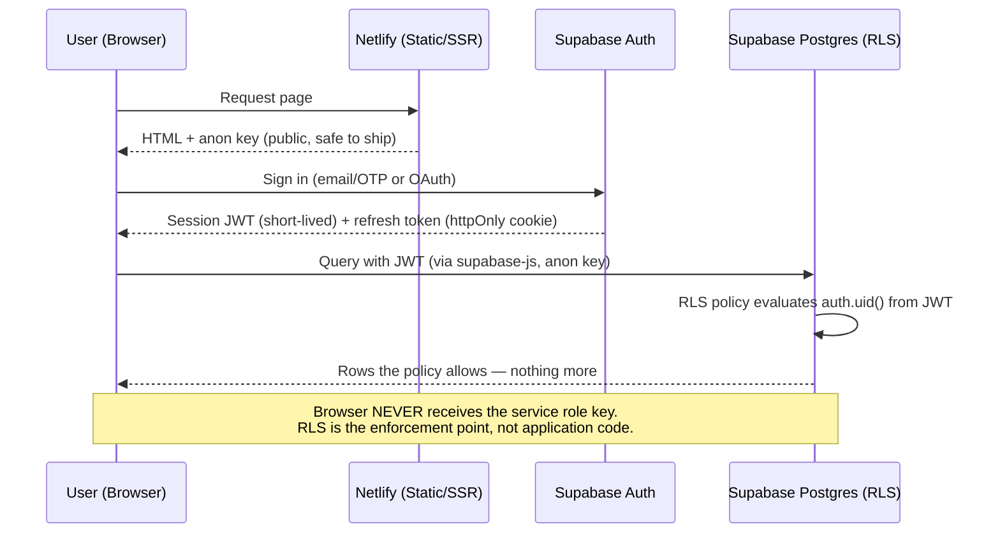
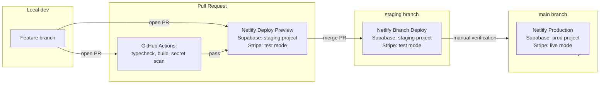

# Data Flow

Two flows matter most for security review: authentication, and payments. Both are diagrammed here; raw Mermaid sources are also in [diagrams/](diagrams/) for reuse in slides/docs elsewhere.

## Authentication & data access flow



**Key invariant:** the same query, run by two different authenticated users, returns different rows because of RLS — not because the client filtered by `user_id` and could theoretically be tricked not to.

## Stripe payment & webhook flow

```mermaid
sequenceDiagram
    participant U as User (Browser)
    participant Fn as Netlify Function
    participant S as Stripe
    participant DB as Supabase Postgres

    U->>Fn: POST /api/checkout (authenticated session)
    Fn->>Fn: Rate limit; validate requested plan against server-side price map
    Fn->>S: Find-or-create customer (search by email first — avoid dupes)
    Fn->>S: Create Checkout Session (metadata: supabase_user_id)
    S-->>Fn: Session URL
    Fn-->>U: Redirect to Stripe-hosted Checkout
    U->>S: Completes payment on Stripe's page (card data never touches your app)
    S-->>Fn: Webhook: checkout.session.completed (signed)
    Fn->>Fn: Verify signature via stripe.webhooks.constructEvent — reject unsigned/invalid with generic 400
    Fn->>DB: Write subscription/entitlement (idempotent: keyed on session/period, safe under Stripe retries)
    DB-->>Fn: OK
    Fn-->>S: 200 (only after the write commits — return 500 on failure so Stripe retries)
```

**Key invariants:**
- Card data never touches your servers (Stripe Checkout is hosted).
- The webhook handler is idempotent — Stripe *will* redeliver events, and duplicate delivery must never double-grant.
- A failed database write after a verified webhook must return a 5xx, not swallow the error — you want Stripe to retry rather than silently drop an entitlement.

## Dev → staging → production promotion path



Nothing is promoted to `main` without having run, at minimum, against the staging Supabase project in test mode first. Database migrations follow the same path — apply to staging, verify, then apply to production (see [Supabase migration workflow](../vendors/supabase.md#migration-workflow)).
