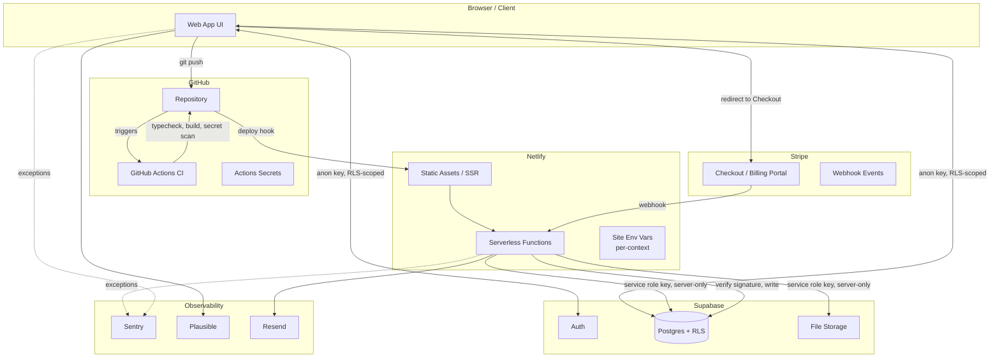

# Reference Architecture

The default stack for a new software business, from Day 0 through early production.

## Default stack

| Layer | Default choice | Owns | Why |
|---|---|---|---|
| Source control & CI/CD | **GitHub** (repo + Actions + Dependabot) | Code, review workflow, automated checks, secret scanning gate | Already the account of record; Actions is sufficient for a single-app MVP; free tier covers early production |
| Hosting / edge / functions | **Netlify** | Static assets, SSR, serverless functions, deploy previews, DNS-adjacent redirects/headers | Git-push deploys, deploy previews per PR, generous free tier, `netlify.toml` is checked into git (reviewable, not UI-only config) |
| Database, auth, storage | **Supabase** | Postgres, Row Level Security, authentication, file storage, (optionally) Edge Functions | Real Postgres (no lock-in to a proprietary query language), RLS gives you tenant isolation at the data layer instead of in application code, generous free tier, managed backups |
| Billing | **Stripe** | Products, prices, Checkout, subscriptions, invoices, customer portal, webhooks | De facto standard, best webhook/idempotency model, Customer Portal removes a whole category of billing UI you'd otherwise build |
| Analytics | **Plausible** (or PostHog if you need product analytics, not just traffic) | Pageviews/conversions without cookie banners | Privacy-first, no consent-banner requirement in most jurisdictions, tiny script |
| Transactional email | **Resend** (or authenticated SMTP via existing Workspace/Google domain for near-zero volume) | Password resets, receipts, notifications | Resend has a real API + webhook model and a free tier; SMTP-via-Workspace is an acceptable Day-0 fallback if volume is near zero, but migrate before you need deliverability guarantees |
| Error tracking | **Sentry** | Exception capture, release tracking, source maps | Free tier is enough for MVP; catches production errors that never reach the founder otherwise — **this was a gap in every prior repo reviewed; do not skip it this time** |
| Secrets | **Netlify environment variables** (site-scoped, context-aware) + **GitHub Actions secrets** | Runtime config, CI credentials | See [secrets-management.md](../docs/secrets-management.md) — the critical rule is per-context separation, which prior projects did not do |

## Why each vendor, specifically

### GitHub over GitLab/Bitbucket
No differentiator strong enough to justify switching from the account you already operate. Actions is "good enough" until you need self-hosted runners or complex matrix builds, which is a growth trigger, not a Day-0 concern.

### Netlify over Vercel
Functionally close substitutes for this use case (git-push deploys, deploy previews, serverless functions, edge middleware). Netlify is the default here because it's the tool with proven, working prior implementations to build on (`standardcraft`), including a real CSP/security-headers config and Astro SSR adapter already validated in production. **Acceptable alternative:** Vercel, if the framework is Next.js-heavy — Vercel's Next.js integration is more first-party. Don't run both; pick one per project.

### Supabase over Firebase/raw AWS/PlanetScale
You get real SQL (Postgres) instead of a NoSQL document model or a proprietary query layer, which matters once the data model gets relational (users, orgs, subscriptions, usage — always relational). RLS lets you push tenant-isolation logic into the database, which is strictly safer than remembering to filter by `tenant_id` in every application query. **Acceptable alternative:** a manually managed Postgres instance (e.g. Neon, RDS) once you outgrow Supabase's specific limits (see growth triggers below) — you keep the schema and RLS policies, you lose the bundled auth/storage/dashboard.

### Stripe over Paddle/LemonSqueezy
Paddle and LemonSqueezy act as merchant-of-record and handle sales tax/VAT for you, which is a real advantage for a solo founder — **this is a legitimate reason to choose them instead, not just an alternative**, if global tax compliance is a bigger unknown than billing engineering. Default to Stripe when you have (or will soon set up) your own tax handling (e.g. Stripe Tax) or are US-only early on; reconsider if VAT/sales-tax registration across many countries becomes the actual bottleneck.

## Component responsibility map

## Trust and security boundaries

- **Browser is untrusted.** It only ever holds the Supabase *anon* key and the Stripe *publishable* key. Every RLS policy must assume the browser can send arbitrary requests as an authenticated (or anonymous) user.
- **Netlify Functions are the trust boundary.** This is the only place the Supabase *service role* key and the Stripe *secret* key are allowed to exist. Never ship either to a client bundle.
- **Stripe webhooks are untrusted until signature-verified.** Every webhook handler must call `stripe.webhooks.constructEvent` (or equivalent) before trusting the payload. Reject with a generic 400 on failure — don't leak why verification failed.
- **GitHub Actions secrets are separate from Netlify env vars**, even when the value is the same (e.g. a Supabase service role key needed both for CI migration checks and at runtime). Rotating one must not require finding every other place the value was pasted — see [secrets-management.md](../docs/secrets-management.md).

## Environment strategy

Three environments, mapped onto Netlify deploy contexts and separate Supabase/Stripe projects:

| Environment | Netlify context | Supabase project | Stripe mode | Purpose |
|---|---|---|---|---|
| Production | `production` (branch: `main`) | `myapp-prod` | Live | Real users, real money |
| Staging | `branch-deploy` (branch: `staging`) | `myapp-staging` | Test | Pre-release verification |
| Preview | `deploy-preview` (per PR) | `myapp-staging` (shared) | Test | Per-PR review, ephemeral |

**This is the single most important deviation from prior implementations.** Every previous project used the same Supabase project and the same Stripe mode across all Netlify contexts — meaning a PR preview could read/write real production data or trigger a real charge. See [environments.md](../docs/environments.md) for the exact Netlify context-variable setup that fixes this.

## Maturity stages

### Day 0 — bootstrap
Create accounts in dependency order (GitHub → Netlify → Supabase ×2 projects → Stripe test mode), scaffold the repo from this template, wire CI secret-scanning before the first line of feature code. No Stripe live mode yet. No custom domain required yet.

### MVP
One production Supabase project, one staging project, Stripe in test mode throughout, Netlify deploying `main` to production and everything else to previews. Auth works, core data model has RLS, no payments required to use the product yet (or payments are stubbed).

### Early production
Stripe live mode enabled, webhooks verified against production endpoint, Sentry capturing real errors, backups verified restorable (not just "enabled"), a documented incident-response step (even a one-page one), custom domain with correct DNS + TLS, basic uptime monitoring.

### Growth triggers — when to reconsider this architecture
- **Supabase → managed Postgres**: sustained connection-pool exhaustion, need for read replicas, or outgrowing Supabase's compute tiers.
- **Netlify → dedicated infra (containers/K8s)**: function cold-start latency becomes user-visible at your traffic pattern, or you need long-running background workers (Netlify Functions have execution time limits).
- **GitHub Actions → self-hosted runners**: CI minutes cost or build time becomes a real bottleneck, or you need GPU/specialized runners.
- **Stripe direct → billing infra layer** (e.g. Orb, Metronome): usage-based/metered billing complexity outgrows Stripe's native metering.
- **Single-region → multi-region**: real latency complaints from a specific geography, not a hypothetical one.

Don't pre-build for these. Notice the trigger, then migrate that one component.
